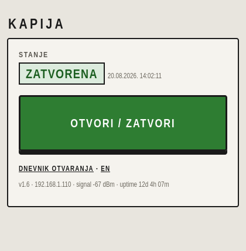
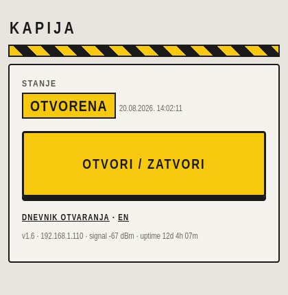

# gate-opener

WiFi remote control for a **Nice Robus 350** sliding-gate drive, built on an
ESP32 that lives inside the drive housing. Tenants open the gate from a phone
browser on the home network; every action is logged. The existing RF remotes
keep working unchanged, and the whole thing runs LAN-only with no cloud, no
accounts and no external services.

In production since 2026-08-04. v1 passed a two-week unattended field test;
currently running v1.6.


## The app

<table><tr>
<td></td>
<td></td>
</tr></table>

One big button, styled like the machine control it is. The panel is
state-colored: green means the gate is closed and secured; caution yellow
with a hazard stripe means it stands open. Croatian UI with an English
toggle (choice remembered per browser).

The state handling mirrors the real Robus step-by-step sequence, learned by
field testing:

- Press while closed: opens, with a live MOVING countdown from the measured
  travel time.
- Press while opening: stops the gate; the app then reports PARTLY OPEN.
- Press while open: closes, with its own countdown.
- Press while closing: the drive reverses to full open (obstacle-safety
  behavior); the countdown resizes to the estimated reopen time.
- Moves started with an RF remote are detected too (the S.C.A. indicator
  blinks during travel) and get the same countdown.

## Features

- Gate state from the drive itself: the Robus S.C.A. output is read through
  an optocoupler, settle-filtered so the travel blinking never flickers the
  display.
- Persistent access log (timestamp, action, client IP) that survives
  reboots, plus a boot entry with firmware version and reset cause
  (power-on / watchdog / brownout / ...) so you always know what the device
  has been doing.
- Optional shared-password login (`REQUIRE_LOGIN`) with brute-force lockout,
  or passwordless operation for a trusted WiFi. CSRF origin checks guard the
  trigger endpoint either way.
- Standalone AP mode (`WIFI_AP_MODE`): the ESP32 broadcasts its own WPA2
  network for sites with no router in range.
- OTA firmware updates: after the first USB flash you never open the
  housing again.
- Daily maintenance reboot at a quiet hour, skipped while the gate is open
  or was just used.

## How it works

```
   phone browser
        |  WiFi, http://kapija.local
        v
   ESP32 web app --- GPIO26 --> relay ------------> P.P. input    (trigger)
        ^
        +---------- GPIO27 <-- PC817 optocoupler <- S.C.A. output (state)
        |
     5 V <-- LM2596 buck <-- 200 mA fuse <-- 33 V accessory tap   (power)

   (everything lives inside the Robus housing)
```

A 0.5 s relay pulse across the P.P. terminals is electrically identical to a
wired button press, so the drive's own logic, photocells, STOP input and
radio receiver stay untouched.

## Hardware

Roughly 15 EUR in parts: an ESP32 devkit, a COM-RM01 relay module, a PC817
optocoupler, an LM2596-type buck converter and a fuse.

One spec is critical: the Robus "24 V" accessory tap actually measures
**33 V**, so the buck converter must accept at least 40 V input. A Mini360
dies instantly and a step-up module cannot work - see the bill of materials.

- Full parts list and buying notes: [hardware/BOM.md](hardware/BOM.md)
- Wiring, terminal map and install checklist: [hardware/WIRING.md](hardware/WIRING.md)
- Platform research on the Nice Robus family: [docs/NICE-ROBUS-NOTES.md](docs/NICE-ROBUS-NOTES.md)

## Build your own

1. Confirm your drive: any Nice Robus (RB350/400/600/1000) with free P.P.
   and S.C.A. terminals should behave the same; other Nice BlueBUS drives
   are likely similar but unverified.
2. Order the parts from [hardware/BOM.md](hardware/BOM.md).
3. Wire per [hardware/WIRING.md](hardware/WIRING.md). Bench-adjust the buck
   converter to 5.0 V **before** connecting the ESP32.
4. `cp firmware/include/config.example.h firmware/include/config.h` and fill
   in WiFi credentials, passwords, pins, and your measured travel times.
5. Build and flash: `pio run -t upload` over USB the first time; later
   updates go over WiFi - see [firmware/README.md](firmware/README.md),
   including the OTA troubleshooting section.
6. One drive setting: set level-2 function L4 so S.C.A. means "on when the
   leaf is open".
7. Open `http://kapija.local` from a phone on the same WiFi.

## Security model

Deliberately LAN-only: the web server must never be exposed to the internet
(no port forwarding). On the local network, access is protected by the WiFi
password, optionally a shared app password (`REQUIRE_LOGIN`), a brute-force
lockout, and an Origin check that stops cross-site and DNS-rebinding tricks
from triggering the gate. OTA flashing has its own separate password.

## Repository layout

```
firmware/   PlatformIO project (ESP32, Arduino framework, no external libs)
hardware/   Bill of materials, wiring diagram, assembly notes, build photo
docs/       Requirements, field-test findings, Nice Robus platform research
```

## License

[MIT](LICENSE). Developed with help of AI; every design decision, wire and
field test by a human at an actual gate.
