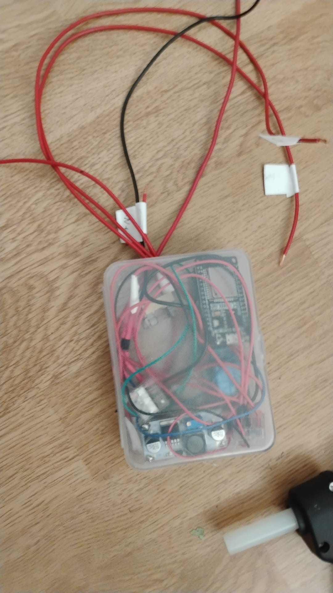

# gate-opener

> 🚧 **Field-testing** — installed at the gate on 2026-08-04, running the
> one-week acceptance period. Final documentation follows after sign-off.

WiFi remote control for a **Nice Robus 350** sliding-gate drive, built on an
ESP32. Tenants open the gate from a phone browser on the local network; every
action is logged. The existing RF remotes keep working unchanged.

## How it works

The ESP32 lives inside the Robus housing and connects to its control board:

- **Trigger** — a relay pulses the Robus **P.P.** (step-by-step) dry-contact
  input, exactly like a button press.
- **Gate state** — the Robus **S.C.A.** (open-gate indicator) output drives an
  optocoupler, so the app shows whether the gate is open or closed.
- **Power** — the board's 24 V accessory tap (33 V measured) feeds a fused
  LM2596-type buck converter (≥40 V input) set to 5 V.

The web app (Croatian UI) offers login with a shared password, an open/close
button with live gate state, and a persistent access log.

## Repository layout

```
firmware/   PlatformIO project (ESP32, Arduino framework, no external libs)
hardware/   Bill of materials, wiring diagrams, assembly instructions
docs/       Requirements and Nice Robus platform research notes
```

## Getting started

1. Buy the parts — see [`hardware/BOM.md`](hardware/BOM.md).
2. Wire the bench setup — see [`hardware/WIRING.md`](hardware/WIRING.md).
3. Build and flash the firmware — see [`firmware/README.md`](firmware/README.md).
4. Open `http://kapija.local` on the same WiFi.

The finished controller — a "flying" Dupont harness in a small box, no perfboard
([`hardware/build.jpeg`](hardware/build.jpeg)):



## Status

- [x] Hardware selected and acquired
- [x] Firmware: web app, relay control, state sensing, logging
- [x] Bench test on breadboard (all acceptance tests pass)
- [x] Installation at the gate (2026-08-04)
- [ ] Field testing (one week unattended), final documentation
